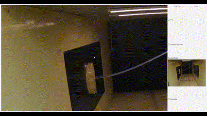

# Image Processing Util

### Interface


This Repository holds the code to GUI interface used to validate aeroelastic phenomena of High Aspect
Ratio Composite Wing Structures using Image Processing against Simulation and Sensor Acquisition.

link to full paper: [Fluid-Structure Interaction Analysis of High Aspect
Ratio Composite Wing Structures](https://ieeexplore.ieee.org/document/10677088)

# Dependencies 
```shell
pip install -r requirements.txt
```

